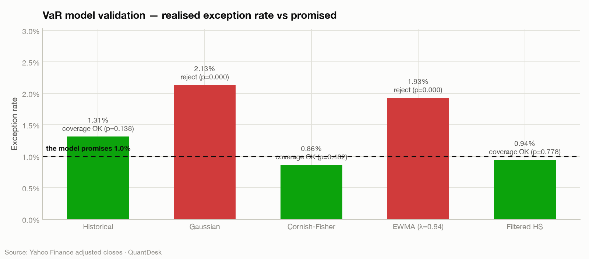
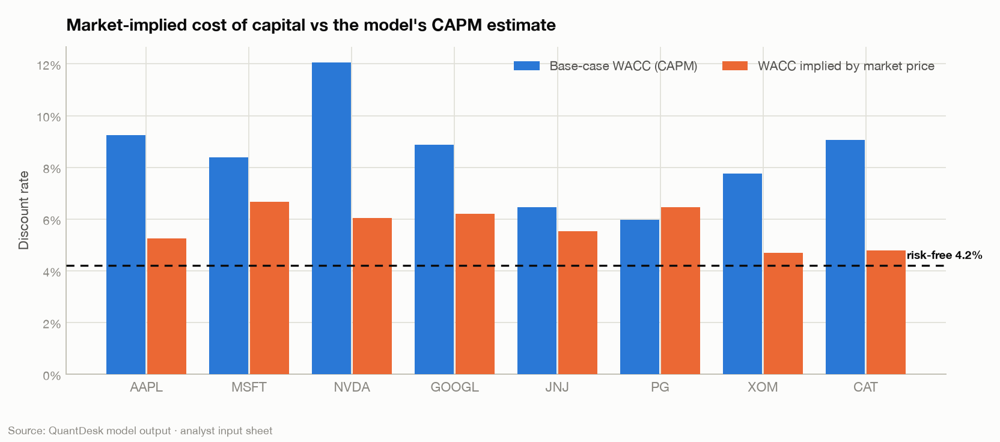
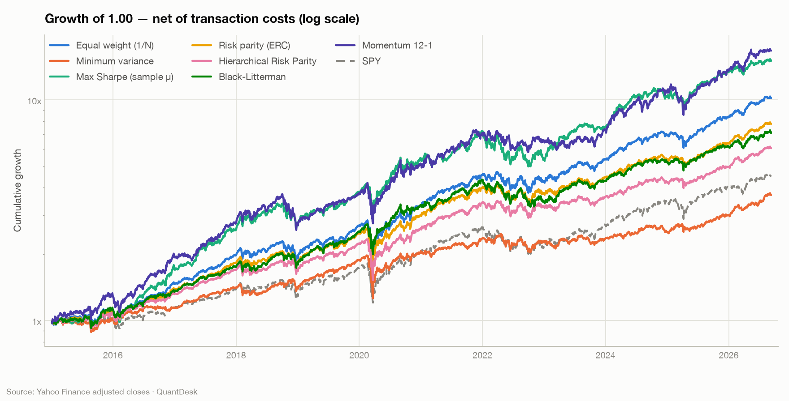
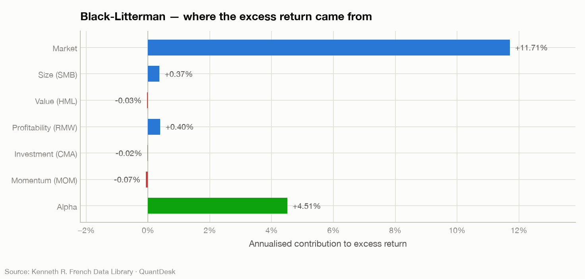

<h1 align="center">QuantDesk</h1>

<p align="center">
  <b>An institutional equity research stack: from raw prices to a tested risk model,<br>
  a factor-controlled allocation, and an intrinsic-value view you can argue with.</b>
</p>

<p align="center">
  <a href="https://bakdauletbolata.github.io/quant-research-desk/"><b>📊 Read the generated research report →</b></a>
</p>

<p align="center">
  <a href="https://github.com/BakdauletBolatA/quant-research-desk/actions/workflows/ci.yml">
    </a>
  
  
  
</p>

---

```bash
git clone https://github.com/BakdauletBolatA/quant-research-desk && cd quant-research-desk
make install && make pipeline      # ~10 seconds, no network needed
open reports/quantdesk_research_report.html
```

One command turns **16 US large caps × 3,691 trading days** into a research report of
**18 figures and 15 tables**: a validated risk model, a walk-forward backtest of seven
allocation rules, and a full valuation of every name — with every assumption in
version-controlled YAML and every claim attached to a test.

The price and factor caches are **committed**, so it reproduces byte-for-byte with
the network switched off. CI proves it: one job rebuilds the entire report on a
runner with no data of its own.

---

## Four findings the report makes, and defends

### 1 · Only one of five VaR models survives a Basel-style backtest

Every risk system quotes a Value-at-Risk number. Almost none of them are backtested.
Rolling five estimators forward out of sample over 2,437 days and testing them with
Kupiec (is the exception *rate* right?) and Christoffersen (do exceptions *cluster*?):

| 1-day 99% VaR estimator | Exceptions | Expected | Realised rate | Kupiec *p* | Christoffersen *p* | Verdict |
|---|---:|---:|---:|---:|---:|---|
| Gaussian | 52 | 24.4 | 2.13% | 0.000 | 0.005 | ❌ understates risk by 2.1× |
| EWMA (λ=0.94) | 47 | 24.4 | 1.93% | 0.000 | 0.310 | ❌ understates risk |
| Historical | 32 | 24.4 | 1.31% | 0.138 | 0.001 | ❌ exceptions cluster |
| Cornish-Fisher | 21 | 24.4 | 0.86% | 0.482 | 0.001 | ❌ exceptions cluster |
| **Filtered Historical Simulation** | **23** | **24.4** | **0.94%** | **0.778** | **0.214** | ✅ **passes both** |

The normal-distribution model — still the default in a lot of production risk
systems — breaches on 2.13% of days while promising 1.00%. Devolatilising returns,
taking the *empirical* tail of the standardised residuals, and re-inflating by
today's conditional volatility fixes both the rate and the clustering.

<p align="center"></p>

### 2 · The market is not disagreeing with the model about earnings. It is disagreeing about the risk premium.

A forward DCF at a 4.2% risk-free rate and a 4.5% equity risk premium marks 7 of 8
names a sell. That is an unfalsifiable opinion, not research. So the model is
**inverted** — fair value is set equal to the market price and solved for the input:

| | AAPL | MSFT | NVDA | GOOGL | JNJ | PG | XOM | CAT |
|---|---:|---:|---:|---:|---:|---:|---:|---:|
| Base-case WACC | 9.3% | 8.4% | 12.1% | 8.9% | 6.5% | 6.0% | 7.8% | 9.1% |
| **WACC implied by the price** | **5.3%** | **6.7%** | **6.0%** | **6.2%** | **5.5%** | **6.5%** | **4.7%** | **4.8%** |
| Base-case 5y revenue CAGR | 5.6% | 11.0% | 16.9% | 10.0% | 3.6% | 2.9% | 1.6% | 3.9% |
| **CAGR required to justify the price** | **31.7%** | **21.0%** | **49.4%** | **26.5%** | **9.5%** | **0.3%** | **19.7%** | **30.7%** |

At these prices the market is accepting an implied cost of capital of **4.7%–6.7%**
against a 4.2% risk-free rate — an equity risk premium of roughly **50 to 250 basis
points**. That is a claim a portfolio manager can take a side on. "My DCF says NVDA
is worth $77" is not.

<p align="center"></p>

### 3 · 1/N is the result to beat, and most of the clever methods don't

Walk-forward from 2015, quarterly rebalancing, 3-year estimation windows, 10bp on
traded notional, positions drifting with prices in between:

| Strategy | CAGR | Vol | **Sharpe** | Max DD | Alpha vs SPY | Ann. turnover | Cost drag |
|---|---:|---:|---:|---:|---:|---:|---:|
| Momentum 12-1 | 27.3% | 23.3% | 1.06 | −34.6% | +10.8% | 2.81× | 35bp |
| Max Sharpe (sample μ) | 26.2% | 20.8% | **1.12** | −31.6% | +10.9% | 1.74× | 22bp |
| **Equal weight (1/N)** | 22.0% | 17.5% | **1.10** | −33.9% | +7.6% | **0.44×** | **5bp** |
| Risk parity (ERC) | 19.2% | 16.4% | 1.03 | −34.1% | +6.2% | 0.44× | 5bp |
| Black-Litterman | 18.3% | 16.7% | 0.96 | **−27.0%** | +5.8% | **0.40×** | 5bp |
| Hierarchical Risk Parity | 16.7% | 15.7% | 0.93 | −34.7% | +4.7% | 0.65× | 7bp |
| Minimum variance | 11.9% | 15.0% | 0.69 | −36.1% | +2.1% | 0.70× | 8bp |
| *SPY (benchmark)* | *13.8%* | *17.6%* | *0.70* | *−33.7%* | — | — | — |

Equal weighting matches the best risk-adjusted result at **a quarter of the
turnover and no estimation at all** — DeMiguel, Garlappi & Uppal (2009), reproduced
out of sample. Black-Litterman buys the smallest drawdown of any rule here (−27.0%
against −33.7% for the index) and trades the least.

<p align="center"></p>

### 4 · Most of the outperformance is beta, and the report says which part isn't

Regressing the Black-Litterman track record on the Fama-French five factors plus
momentum with Newey-West standard errors: **R² = 0.84**, market beta **0.85**, and an
intercept of **+4.5% a year with a HAC t-statistic of 2.31** (*p* = 0.02). Of the
**16.1 points** of annualised excess return, market exposure accounted for **11.7**
and residual alpha for **4.5**; the four style factors together contributed 0.7.

Plain OLS standard errors on daily data would have made that t-statistic look
considerably better than it deserves — which is the whole reason the HAC correction
is not optional. (The +5.8% in the table above is Jensen's alpha against SPY alone;
controlling for size, value, profitability, investment and momentum takes it to
+4.5%.)

<p align="center"></p>

---

## What is in the box

```
src/quantdesk/
├── data/            offline-first price + factor layer, aligned once
│   ├── market.py      Yahoo chart endpoint, host failover, exponential backoff, disk cache
│   ├── factors.py     Fama-French 5 factors + momentum from the French library
│   └── panel.py       ResearchPanel — prices, returns, benchmark, risk-free, factors
├── analytics/
│   ├── performance.py CAGR · Sharpe/Sortino/Calmar/Omega/Ulcer · drawdown episodes
│   │                  · Probabilistic and Deflated Sharpe Ratios
│   ├── risk.py        5 VaR estimators · Expected Shortfall · Kupiec + Christoffersen
│   └── factor_model.py FF5+MOM regression with Newey-West HAC errors · attribution
├── valuation/
│   ├── dcf.py         two-stage FCFF · mid-year discounting · steady-state reinvestment
│   ├── reverse_dcf.py Brent solvers for the growth, CAGR and WACC implied by the price
│   ├── monte_carlo.py 20k-path vectorised simulation over four drivers
│   ├── excess_return.py residual income for banks — FCFF is meaningless for a bank
│   ├── comps.py       EV-based multiples · peer quartiles · football field
│   └── wacc.py        market-value-weighted WACC · CAPM · Hamada
├── portfolio/
│   ├── covariance.py  sample · Ledoit-Wolf shrinkage · EWMA · PSD repair
│   ├── optimizer.py   min-var · max-Sharpe · ERC · max-diversification · HRP · frontier
│   └── black_litterman.py equilibrium prior · Idzorek confidence · absolute + relative views
├── backtest/
│   ├── engine.py      point-in-time walk-forward · weight drift · costs on traded notional
│   └── strategies.py  8 allocation rules behind a look-ahead-proof context object
├── reporting/
│   ├── charts.py      18 figures on a CVD-validated palette
│   ├── tearsheet.py   self-contained HTML report (images inlined)
│   └── excel.py       formatted xlsxwriter workbook
├── pipeline.py        seven stages → report + workbook + figures
└── cli.py             quantdesk data | run | backtest | value TICKER
```

```bash
quantdesk value NVDA     # projection, WACC, Monte Carlo, and the reverse DCF narrative
quantdesk backtest       # the walk-forward comparison table
quantdesk run            # everything
```

---

## Modelling choices worth defending in an interview

Each of these is a decision where the obvious answer is the wrong one.

| Choice | Why the default is wrong |
|---|---|
| **Terminal value from steady-state reinvestment** (`g / ROIC`), not by growing the last forecast year's FCFF | Gordon-on-FCFF silently assumes the final year's capex/D&A relationship holds forever. For a company mid-investment-cycle that alone moves fair value by ~30%. Growth has to be paid for. |
| **Terminal ROIC set per company** in the input sheet, not defaulted to WACC | ROIC = WACC asserts every franchise competes its returns to zero economic profit, valuing Apple's ecosystem and a commodity refiner identically. |
| **Mid-year discounting** | Cash arrives through the year, not on 31 December. End-year discounting understates value by exactly √(1+WACC) — about 4% at a 9% WACC, larger than most of what a junior model argues about. |
| **Banks on residual income**, never FCFF | For a bank, leverage *is* the operation and the loan book *is* the working capital. The FCFF bridge has no meaning. If ROE = Ke forever, the bank is worth exactly book. |
| **Black-Litterman δ derived as ERP / market variance** | The textbook δ = 2.5–3.0 implies a 14.5% equilibrium return on this universe, silently overwriting the 4.5% ERP the valuation chapter runs on. Derived: δ = 0.874, and the prior reproduces 4.50% exactly. |
| **Risk parity via the convex log-barrier form** | Minimising the squared dispersion of risk contributions is non-convex and start-point dependent. The log-barrier problem has a unique solution; risk-contribution dispersion here is 2×10⁻¹⁷. |
| **Ledoit-Wolf shrinkage** on the covariance matrix | The optimiser keys on the smallest eigenvalues — the directions estimated with the least precision — and answers with a portfolio long and short the estimation error. |
| **HRP as the non-inverting alternative** | Hierarchical Risk Parity clusters, quasi-diagonalises and bisects; it never inverts the covariance matrix, so it survives the ill-conditioning that wrecks mean-variance on short windows. |
| **Newey-West standard errors** on every factor regression | Daily residuals are heteroskedastic and autocorrelated; OLS errors routinely halve the true standard error of alpha, turning noise into a two-sigma "result". |
| **Adjusted closes only** | On a 10-year window an unadjusted series understates a dividend payer such as XOM by hundreds of basis points a year and corrupts every risk statistic downstream. |
| **Cornish-Fisher moments clamped** to the expansion's validity domain | Full-sample equity kurtosis is ~15, far outside where the expansion stays monotonic. The raw formula returns a VaR no risk committee would sign. |
| **Deflated Sharpe Ratio reported for every strategy** | Seven strategies were tried on one sample. With enough attempts a Sharpe of 1.0 is the *expected* result of pure noise. The correction is reported for the unflattering rows too. |

---

## What this study cannot tell you

A research note that lists no limitations is hiding them. In order of how much they matter:

- **Universe selection is the largest bias here.** These 16 names were chosen in 2026
  and are today's US large caps, so every strategy inherits the hindsight of picking
  companies that survived and compounded. **The absolute returns are not investable
  alpha.** What remains valid is the *relative* comparison: every allocator faces the
  identical universe, calendar, costs and constraints, so the ranking between them is
  a fair test even though the level is not.
- **No delisted or acquired names**, and no point-in-time index membership.
- **Single market, single currency.** US large-cap equity only — the correlation
  structure is far friendlier than a real book's.
- **Long-only, fully invested.** No shorting, leverage, cash sleeve or derivatives.
- **Costs are a flat 10bp** on traded notional. Real costs are state-dependent and
  rise exactly when a strategy most wants to trade. Market impact and borrow are not
  modelled.
- **The valuation inputs are the author's own normalised estimates**, not a
  fundamentals feed. They are versioned in [`config/fundamentals.yaml`](config/fundamentals.yaml)
  so they can be re-keyed from filings and the whole report regenerated in one
  command — that is the mitigation, not a claim that they are audited.
- **The factor library lags prices** by several weeks, so factor statistics use the
  overlapping window while performance figures use the full one.

Nothing here is investment advice, a price target, or a recommendation.

---

## Tests

207 tests, and each one checks the property that *defines* a component rather than a
stored output — a snapshot test would happily pass a subtly wrong risk-parity solver.

```bash
make test
```

- **Analytics** — zero-growth DCF equals `NOPAT / WACC` exactly; mid-year discounting
  worth exactly `√(1+WACC)`; gaussian VaR against its closed form; Kupiec LR = 0 at
  the exact expected exception rate; Christoffersen rejecting deliberately clustered
  exceptions; beta and alpha recovered from planted factor loadings.
- **Optimisers** — min-variance beaten by no random Dirichlet draw out of 200; risk
  parity equalising risk contributions to 10⁻⁹; HRP surviving a singular covariance
  matrix; Black-Litterman honouring a certain view and ignoring a worthless one.
- **No look-ahead** — weights chosen on date *d* must not change when every
  observation after *d* is deleted, checked for four allocators; and doctoring a
  future return must not move any earlier one.
- **Cross-implementation** — the vectorised 20k-path Monte Carlo is pinned to the
  pandas DCF at zero shocks, so the fast path cannot drift from the reference.
- **Round-trips** — the reverse DCF's solved WACC, terminal growth and revenue CAGR
  each reproduce the market price when plugged back in.
- **Reporting** — the formatting guard that stops 14,700 shares printing as
  1,470,000%; HTML escaping of untrusted cells; no external asset references.

Two real bugs the suite caught: risk parity converging only to the optimiser's
tolerance (fixed with fixed-point polish steps on the stationarity condition), and
the reverse-DCF growth bracket returning NaN for names trading *below* fair value.

---

## Data and reproducibility

| | |
|---|---|
| **Prices** | Daily adjusted closes, public Yahoo Finance chart endpoint, cached to `data/raw/prices/` |
| **Factors & risk-free** | [Kenneth R. French Data Library](https://mba.tuck.dartmouth.edu/pages/faculty/ken.french/data_library.html), cached to `data/raw/factors/` |
| **Fundamentals** | `config/fundamentals.yaml` — the analyst's own input sheet, clearly labelled |
| **Sample** | 2012-01-04 → 2026-09-09 · 3,691 trading days · 16 names + SPY |
| **Stack** | Python 3.11+ · pandas · NumPy · SciPy · statsmodels · scikit-learn · matplotlib · Jinja2 · XlsxWriter |

Both caches are committed. `make pipeline` needs no network, and CI runs it on a
clean runner to keep that claim honest.

---

<p align="center">
  <sub>MIT licensed · Built by <a href="https://github.com/BakdauletBolatA">Bakdaulet Bolat</a></sub>
</p>
